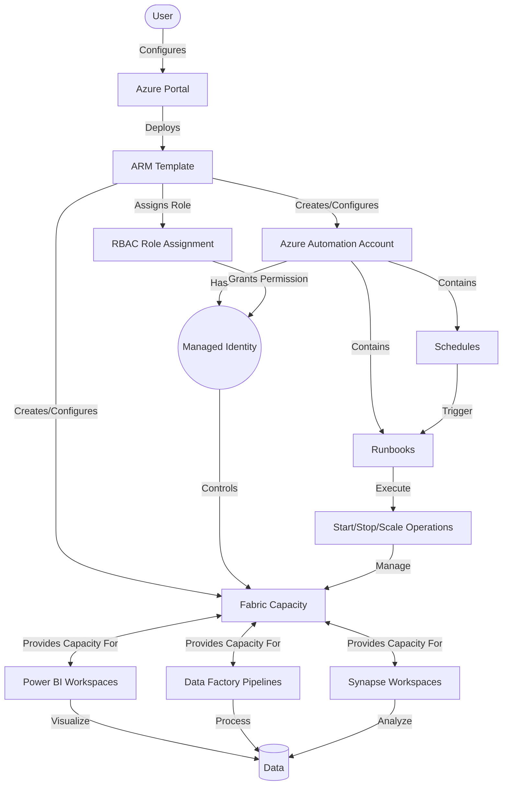

# Microsoft Fabric Capacity Automation

Automate the management of Microsoft Fabric capacities in Azure, allowing you to start, stop, and scale capacities on a schedule or through manual triggers.

This script has been shared by the [Phoenix Dataworks](https://phoenixdaa.works). Contact us with any issues or if you need help with this or similar solutions.

## Overview

This solution deploys Azure Automation runbooks that can control Microsoft Fabric capacities in your Azure subscription. It requires existing resources and adds automation capabilities to them.

## Quick Start

1. Ensure you have an existing Azure Automation account and Fabric capacity
2. Deploy the solution using the [ARM template](arm-templates/azuredeploy.json)
3. Configure schedules for automatic start/stop of capacities
4. Create manual webhooks for on-demand control
5. Monitor automation job status in the Azure portal

For detailed instructions, see the [Automated Deployment Guide](Automated-Deployment-Guide.md).

## Key Components

- **Azure Automation Account**: Hosts the runbooks and schedules
- **System-assigned Managed Identity**: Used for secure, passwordless authentication
- **PowerShell Runbooks**:
  - `Start-FabricCapacity.ps1`: Starts a stopped capacity
  - `Stop-FabricCapacity.ps1`: Stops a running capacity
  - `Scale-FabricCapacity.ps1`: Scales a capacity to a specified SKU
  - `Get-FabricCapacityStatus.ps1`: Gets the current status of a capacity
- **Automatic Role Assignment**: Creates necessary RBAC permissions during deployment

## Prerequisites

- An Azure subscription
- Contributor access to the Azure subscription or resource group
- PowerShell 7.0 or later (for local deployment)
- Sufficient Fabric Capacity Units (CUs) quota in your Azure subscription for your desired SKU

## Fabric Capacity Quotas

Each Azure subscription has limits (quotas) on the number of Fabric Capacity Units (CUs) available. Before scaling to larger SKUs, verify your subscription has sufficient quota:

- F2 requires 2 CUs, F4 requires 4 CUs, F8 requires 8 CUs, etc.
- F64 requires 64 CUs, F128 requires 128 CUs, etc.

To check your current quota:
1. Sign in to the Azure portal
2. Search for "quotas" and select **Quotas**
3. Filter for **Microsoft Fabric** provider
4. Check the difference between your limit and current usage

If you need a quota increase, you can request it directly in the Azure portal through the Quotas page or by creating a support request.

For more information on Fabric capacity quotas, see [Microsoft Fabric capacity quotas](https://learn.microsoft.com/en-us/fabric/enterprise/fabric-quotas).

## Solution Architecture

## Deployment Options

### Azure Portal / Marketplace

1. The solution can be deployed via Azure Portal using the provided ARM templates
2. Configure the following settings during deployment:
   - **Automation Account Name**: Create new or use existing
   - **Fabric Capacity Name**: Create new or use existing
   - **Fabric Capacity Administrator**: Enter email/UPN of user for capacity admin
   - **Schedule Times**: Set times for capacity start, scale up, scale down, and stop
   - **Time Zone**: Select time zone for schedules (e.g., "United States - Pacific Time")
   - **Schedule Days**: Select days of the week for automated operations

### ARM Template

1. Use the ARM templates in the `arm-templates` directory:
   - `mainTemplate.json`: Main ARM template
   - `createUiDefinition.json`: UI definition for Azure Portal experience

## Security and Permissions

The solution uses a system-assigned managed identity with:
- **Contributor** role automatically assigned to the resource group containing the Fabric capacity
- **Automation Job Operator** role on the Automation account

Role assignments are automatically created during deployment, ensuring proper permissions to manage Fabric capacities.

## Common Usage Scenarios

### Daily Office Hours

1. Start capacity at 8:00 AM Monday-Friday
2. Scale to appropriate size during peak hours
3. Stop capacity at 6:00 PM Monday-Friday

### Batch Processing

1. Start capacity at 11:00 PM
2. Scale to high-performance SKU
3. Run intensive workloads
4. Stop capacity when processing completes

### Development Environment

1. Run on-demand during development hours
2. Stop automatically after hours
3. Remain stopped on weekends

## Creating Manual Webhooks

To manually create webhooks for on-demand operations:

1. Navigate to your Azure Automation account
2. Select "Runbooks" and choose the desired runbook
3. Click "Webhooks" and "Add webhook"
4. Provide a name and expiration date
5. Copy and securely store the URL (it won't be shown again)
6. Configure the webhook parameters

## Advanced Configuration

The solution is highly configurable:

- **Multiple capacities**: Control multiple Fabric capacities
- **Complex schedules**: Create day/time-based patterns
- **Scaling patterns**: Define custom scaling scenarios

## Troubleshooting

Common issues and their solutions:

- **Permission errors**: Verify role assignment has been created for the managed identity. Allow 5-10 minutes for RBAC propagation after deployment.
- **Module import failures**: Verify the required modules are available in your Automation account
- **Webhook failures**: Ensure the URL is valid and parameters are correctly formatted
- **Resource errors**: Verify both the Automation account and Fabric capacity exist before deployment

## Contributing

Contributions are welcome! Please open issues and pull requests on GitHub.

## License

This project is licensed under the MIT License - see the LICENSE file for details.

## Acknowledgments

- Microsoft Azure Documentation
- Microsoft Fabric Documentation
- Power BI Community
- Power Automate Community
