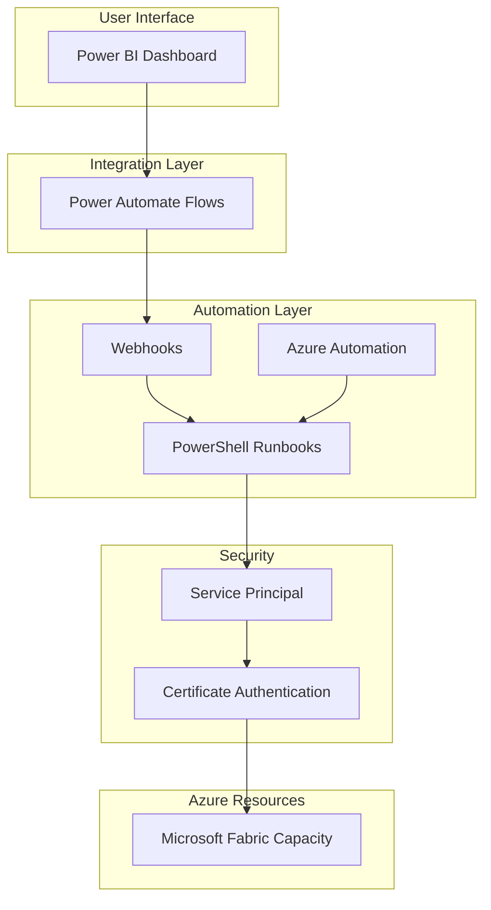

# Azure Fabric Capacity Automation - Solution Architecture

This document provides a detailed overview of the solution architecture for automating the start and stop of Microsoft Fabric capacities in Azure.

## Overview

The solution enables users to control Microsoft Fabric capacities without requiring direct access to the Azure portal. It provides a user-friendly interface through Power BI, allowing users to start, stop, and check the status of Fabric capacities.

## Architecture Diagram

## Component Details

### 1. User Interface Layer

**Power BI Dashboard**

- Provides a user-friendly interface for controlling Fabric capacities
- Displays the current status of the capacity (Running/Paused)
- Includes buttons for starting and stopping the capacity
- Shows historical status information
- Refreshes automatically to show the latest status

### 2. Integration Layer

**Power Automate Flows**

- Connects the Power BI dashboard to the Azure Automation webhooks
- Handles the button click events from the Power BI dashboard
- Calls the appropriate webhook based on the user action
- Processes the response from the webhook and updates the Power BI dataset
- Provides error handling and notifications

### 3. Automation Layer

**Azure Automation Account**

- Hosts and executes the PowerShell runbooks
- Manages the webhooks for external access
- Stores the credentials and certificates securely
- Provides scheduling capabilities for automatic start/stop
- Logs all operations for auditing and troubleshooting

**PowerShell Runbooks**

- **Start-FabricCapacity.ps1**: Starts (resumes) a paused Fabric capacity
- **Stop-FabricCapacity.ps1**: Stops (pauses) a running Fabric capacity
- **Get-FabricCapacityStatus.ps1**: Retrieves the current status of a Fabric capacity
- **Schedule-FabricCapacity.ps1**: Creates schedules for automatically starting and stopping the Fabric capacity
- **Create-FabricCapacityWebhooks.ps1**: Creates webhooks for the Fabric capacity runbooks

**Webhooks**

- Provide HTTP endpoints for triggering the runbooks
- Secure access to the runbooks with webhook tokens
- Allow integration with external systems like Power Automate
- Include the necessary parameters for the runbooks

### 4. Azure Resources

**Microsoft Fabric Capacity**

- The target resource being controlled
- An F2 or higher capacity that can be paused and resumed
- Associated with a specific subscription, resource group, and name
- Accessible via the Microsoft Fabric API

### 5. Security Layer

**Service Principal**

- An Azure AD application used for authentication
- Assigned the necessary permissions to control the Fabric capacity
- Uses certificate-based authentication for enhanced security
- No passwords stored in the solution

**Certificate Authentication**

- X.509 certificate used for authenticating the service principal
- Stored securely in the Azure Automation certificate store
- More secure than client secret authentication
- Can be rotated without changing the service principal

## Authentication Flow

1. The PowerShell runbook authenticates to Azure using the service principal and certificate
2. Azure AD validates the certificate and issues an access token
3. The runbook uses the access token to call the Microsoft Fabric API
4. The Microsoft Fabric API validates the token and performs the requested operation

## Data Flow

### Starting a Fabric Capacity

1. User clicks the "Start Capacity" button in the Power BI dashboard
2. Power Automate flow is triggered by the button click
3. Flow calls the Start-FabricCapacity webhook
4. Webhook triggers the Start-FabricCapacity runbook
5. Runbook authenticates using the service principal and certificate
6. Runbook calls the Microsoft Fabric API to start the capacity
7. Runbook waits for the capacity to start (if configured)
8. Runbook returns the status to the webhook
9. Webhook returns the status to the Power Automate flow
10. Flow updates the Power BI dataset with the new status
11. Power BI dashboard refreshes to show the updated status

### Stopping a Fabric Capacity

1. User clicks the "Stop Capacity" button in the Power BI dashboard
2. Power Automate flow is triggered by the button click
3. Flow calls the Stop-FabricCapacity webhook
4. Webhook triggers the Stop-FabricCapacity runbook
5. Runbook authenticates using the service principal and certificate
6. Runbook calls the Microsoft Fabric API to stop the capacity
7. Runbook waits for the capacity to stop (if configured)
8. Runbook returns the status to the webhook
9. Webhook returns the status to the Power Automate flow
10. Flow updates the Power BI dataset with the new status
11. Power BI dashboard refreshes to show the updated status

### Checking Capacity Status

1. Power BI dataset refresh is triggered (scheduled or manual)
2. Power Automate flow is triggered by the refresh
3. Flow calls the Get-FabricCapacityStatus webhook
4. Webhook triggers the Get-FabricCapacityStatus runbook
5. Runbook authenticates using the service principal and certificate
6. Runbook calls the Microsoft Fabric API to get the capacity status
7. Runbook returns the status to the webhook
8. Webhook returns the status to the Power Automate flow
9. Flow updates the Power BI dataset with the current status
10. Power BI dashboard shows the updated status

## Scheduled Operations

The solution can be configured to automatically start and stop the Fabric capacity on a schedule:

1. The Schedule-FabricCapacity.ps1 script creates two schedules in Azure Automation:
   - A schedule for starting the capacity at the specified start time
   - A schedule for stopping the capacity at the specified stop time
2. The schedules can be configured to run on weekdays only or every day
3. The schedules trigger the Start-FabricCapacity and Stop-FabricCapacity runbooks
4. The runbooks perform the same operations as described above

## Security Considerations

The solution uses multiple layers of security:

1. **Service Principal with Certificate Authentication**
   - More secure than client secret authentication
   - Certificate can be rotated without changing the service principal
   - No passwords stored in the solution

2. **Limited Permissions**
   - Service principal is assigned only the necessary permissions
   - Follows the principle of least privilege
   - Only has access to the specific Fabric capacity

3. **Webhook Security**
   - Webhooks use unique, randomly generated URLs
   - Webhook URLs contain security tokens
   - Webhooks can be configured to expire after a certain period

4. **Power BI Dashboard Security**
   - Power BI dashboard can be shared with specific users or groups
   - Access to the dashboard can be controlled through Power BI workspace permissions
   - Dashboard can be published to a Power BI app for easier distribution

## Monitoring and Logging

The solution includes monitoring and logging capabilities:

1. **Azure Automation Job Logs**
   - Each runbook execution creates a job with detailed logs
   - Logs include all operations performed by the runbook
   - Logs can be used for troubleshooting and auditing

2. **Power BI Dataset Refresh History**
   - Power BI keeps a history of dataset refreshes
   - Refresh history can be used to verify that the status is being updated
   - Refresh failures are logged and can be investigated

3. **Power Automate Flow Run History**
   - Power Automate keeps a history of flow runs
   - Flow run history includes all actions performed by the flow
   - Flow failures are logged and can be investigated

## Scalability

The solution can be extended to support multiple Fabric capacities:

1. **Multiple Runbook Instances**
   - Each capacity can have its own set of runbooks
   - Runbooks can be parameterized to support multiple capacities
   - Schedules can be created for each capacity

2. **Multiple Power BI Dashboards**
   - Each capacity can have its own dashboard
   - Dashboards can be combined into a single dashboard for easier management
   - Dashboard can include filters to show specific capacities

## Maintenance

To ensure the solution continues to function correctly, perform the following maintenance tasks:

1. **Certificate Renewal**
   - The certificate used for authentication should be renewed before it expires
   - Default certificate validity is 2 years
   - New certificate should be uploaded to Azure Automation and the thumbprint updated

2. **Webhook Renewal**
   - Webhooks expire after the configured period (default: 1 year)
   - Use the Create-FabricCapacityWebhooks.ps1 script to recreate the webhooks
   - Update the webhook URLs in the Power Automate flows

3. **Runbook Updates**
   - Runbooks may need to be updated if the Microsoft Fabric API changes
   - Test updates in a non-production environment before applying to production
   - Keep a backup of the original runbooks

## Disaster Recovery

In case of a disaster, the solution can be recovered using the following steps:

1. **Azure Automation Account**
   - Recreate the Azure Automation account if necessary
   - Import the runbooks from the backup
   - Upload the certificate to the new account
   - Recreate the schedules and webhooks

2. **Power BI Dashboard**
   - Restore the Power BI dashboard from a backup
   - Recreate the dataset and report if necessary
   - Update the webhook URLs in the Power Automate flows

3. **Service Principal**
   - If the service principal is deleted, create a new one
   - Assign the necessary permissions to the new service principal
   - Update the application ID in the runbooks

## Conclusion

This solution provides a secure, scalable, and user-friendly way to automate the start and stop of Microsoft Fabric capacities in Azure. By using Power BI as the user interface and Azure Automation for the backend, it enables users to control Fabric capacities without requiring direct access to the Azure portal.

The architecture is designed to be secure, with certificate-based authentication and limited permissions. It is also designed to be maintainable, with clear separation of concerns and well-documented components.

By automating the start and stop of Fabric capacities, organizations can reduce costs by running capacities only when needed, while still ensuring that capacities are available when required.
